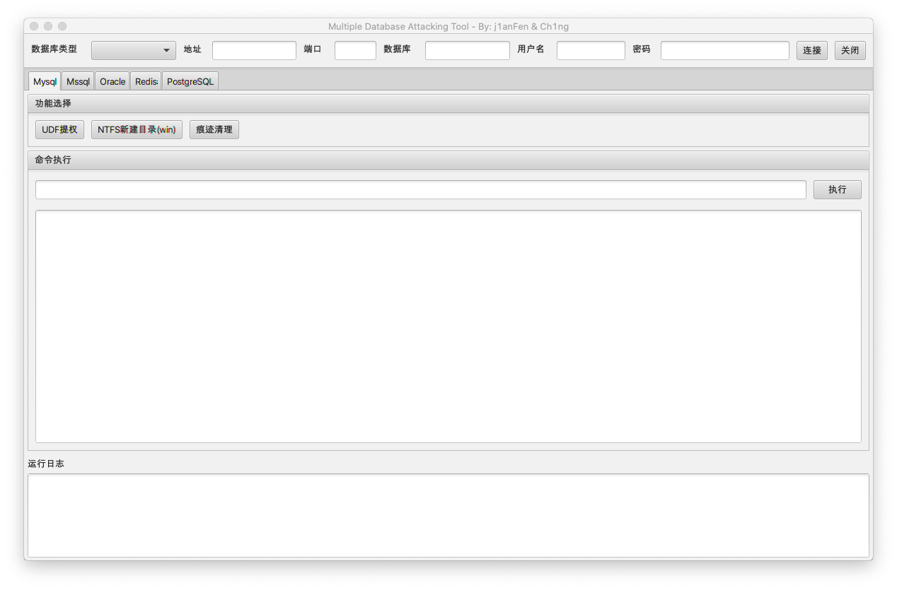

# MDAT
一款用于数据库攻击的利用工具，集合了多种主流的数据库类型。由 Ch1ng & j1anFen 共同完成开发。

# 起因
由于各种数据库攻击利用工具需要各种环境导致使用相当不便，便萌生了开发此工具的想法，将常用的数据库集合在一起并且优化当时工具的一些不足。工具没有神仙技巧，都是网上现成的 POC 集合，更多的是开发时候对 JavaFx 的操控。

# 更新日志
- 2020-12-30 - MDAT v1.0 发布

# 功能
## Mysql
## Mssql
- 使用 jTDS 包，支持 Microsoft SQL Server (6.5, 7, 2000, 2005, 2008 and 2012) 数据库版本
- 支持 Sp_OACreate 命令回显(依赖 bulk insert 命令)
- 支持文件浏览功能
## Oracle
## Redis
## PostsgreSql

# TODO
1. 完善 Mssql 的功能
2. 完成 Oracle 的开发

# 参考
sql综合利用工具(sqltools)

