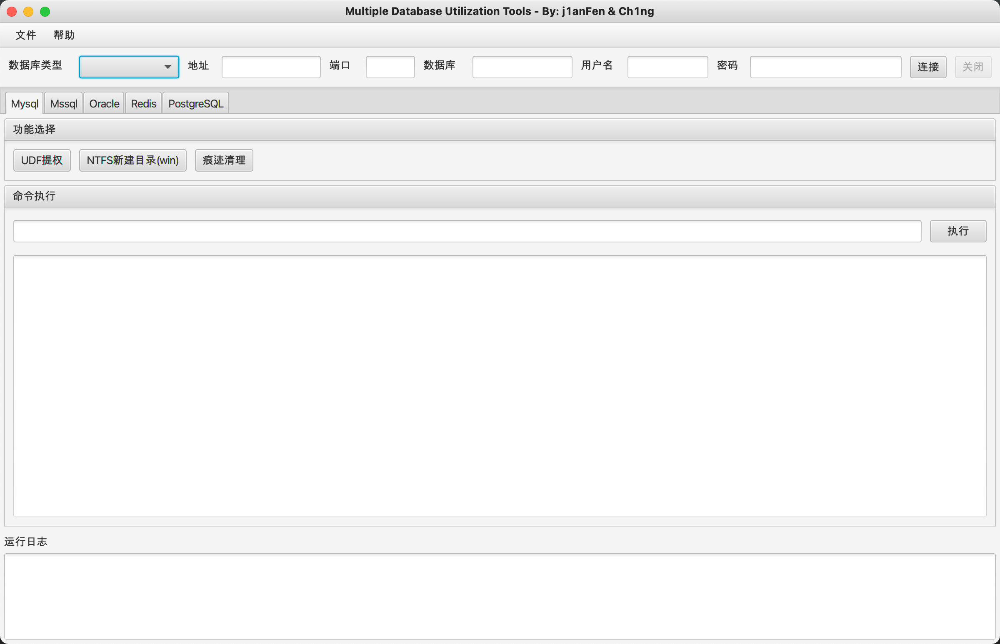

# MDUT
一款用于数据库利用工具，集合了多种主流的数据库类型。由 Ch1ng & j1anFen 共同完成开发。

# 起因
由于各种数据库利用工具需要各种环境导致使用相当不便，便萌生了开发此工具的想法，将常用的数据库集合在一起并且优化当时工具的一些不足。工具没有神仙技巧，都是网上现成的 POC 集合，更多的是开发时候对 JavaFx 的操控。

# 更新日志
- 2020-12-30 - MDAT v1.0 发布
- 2021-01-06 - MDAT v1.1
  - 增加更新检测功能
  - 增加关闭、关于按钮
  - **Oracle**
    - 增加创建函数功能使用前需要先按照对应账号权限创建函数
    - 增加反弹 Shell 功能
    - 增加多种命令执行类型
    - 增加清除痕迹功能
    - 微调 UI 交互
  - **Mssql**
    - 增加激活组件功能
    - 增加 SPOACREATE COM 组件的命令执行方式
    - 优化清理痕迹功能
- 2021-02-03 - MDAT v1.2
  - **Mssql**
    - 完善文件管理功能
    - 增加获取管理员密码功能
    - 优化用户交互逻辑
- 2021-04-22 - MDUT v1.2.1
  - MDAT 改名为 MDUT

# 功能
## Mysql
- 传统UDF提权自适应版本
- NTFS创建目录(鸡肋基本没成功过)

## Mssql
- 使用 jTDS 包，支持 Microsoft SQL Server (6.5, 7, 2000, 2005, 2008 and 2012) 数据库版本
- 支持 Sp_OACreate 命令回显(依赖 bulk insert 命令)
- 支持 Sp_OACreate 命令回显(COM 组件)
- 支持文件浏览功能

## Oracle
- 支持命令执行功能(测试 Oracle 为版本 10 和 11)
- 支持反弹 Shell 功能
- XMLQUERY 功能本地测试不稳定，会出现没有 JAVA 权限，不推荐使用。

## PostsgreSql
- 8.2以下版本使用默认库执行 /lib/x86_64-linux-gnu/libc.so.6 /lib/libc.so.6 /lib64/libc.so.6
- 8.2-9.2使用UDF提权（目前程序已编译9.0, 9.1, 9.2）
- 9.3-Latest(默认使用cve-2019-9193提权)

## Redis
- 涉及主从与远程交互暂未写

# TODO
1. ~~增加 Mssql CLR 的功能~~
2. 增加全局延时功能
3. Redis
4. 数据库查询功能
5. Oracle 文件管理功能
6. ~~Oracle 反弹 Shell 功能~~

等等。。

# 参考
- sql综合利用工具(sqltools)
- [PayloadsAllTheThings](https://github.com/swisskyrepo/PayloadsAllTheThings/blob/master/SQL%20Injection/PostgreSQL%20Injection.md)

## 法律
> 该项目仅供合法的渗透测试以及爱好者参考学习，请各位遵守《中华人民共和国网络安全法》以及相应地方的法律，禁止使用该项目进行违法操作，否则自行承担相关责任！
